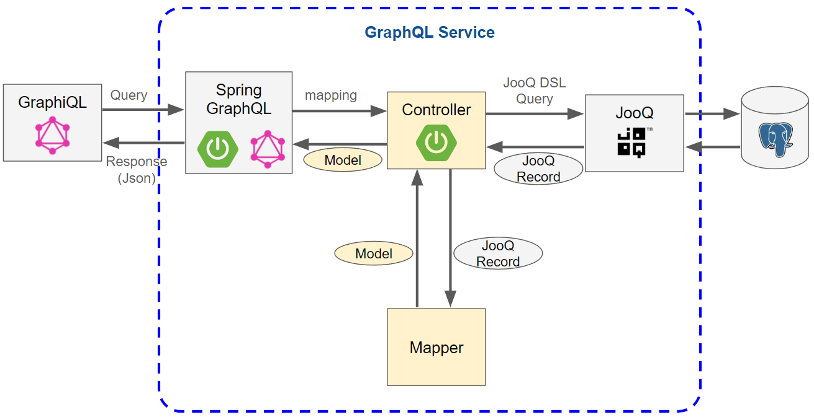
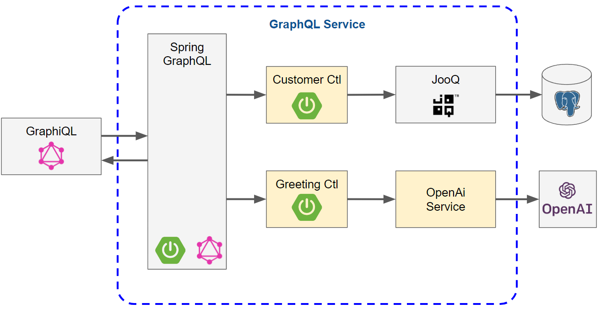
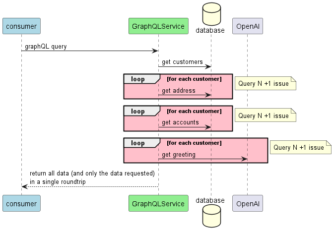
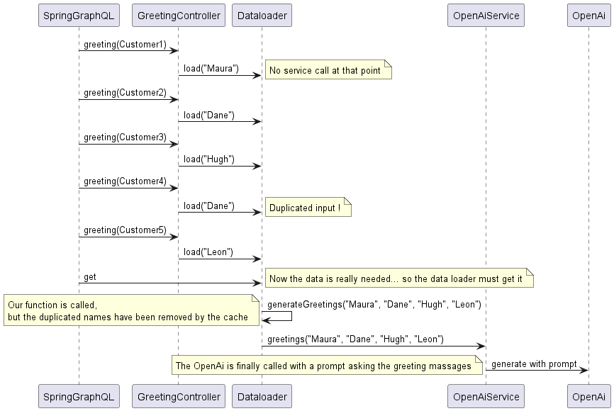
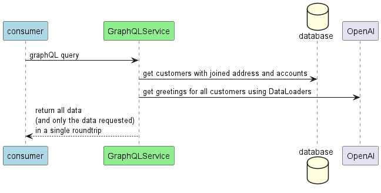

= Spring for GraphQL
:revealjs_customtheme: css/sky.css
// :revealjs_autoSlide: 5000
// :revealjs_history: true
// :revealjs_fragmentInURL: true
:revealjs_viewDistance: 5
:revealjs_width: 1408
:revealjs_height: 792
:revealjs_controls: true
:revealjs_controlsLayout: edges
:revealjs_controlsTutorial: true
// :revealjs_slideNumber: c/t
// :revealjs_showSlideNumber: speaker
// :revealjs_autoPlayMedia: true
// :revealjs_defaultTiming: 42
// //:revealjs_transitionSpeed: fast
// :revealjs_parallaxBackgroundImage: images/background-landscape-light-orange.jpg
// :revealjs_parallaxBackgroundSize: 4936px 2092px
:customcss: css/presentation.css
// :imagesdir: images
// :source-highlighter: highlightjs
// :highlightjs-theme: css/atom-one-light.css
// // we want local served font-awesome fonts
:iconfont-remote!:
:iconfont-name: fonts/fontawesome/css/all

Implementation & Performance Optimisations

[%auto-animate]
[.lightbg,background-video="videos/agenda-bg.mp4",background-video-loop="true",background-opacity="0.7"]
== Agenda

[grid=none]
[frame=none]
[cols="^.^a,^.^a"]
|===

2+|image::images/grahpql_logo_inner.png[height=200]

|===

[%auto-animate]
[.lightbg,background-video="videos/agenda-bg.mp4",background-video-loop="true",background-opacity="0.7"]
== Agenda

[grid=none]
[frame=none]
[cols="^.^a,^.^a"]
|===

|image::images/grahpql_logo_inner.png[height=200]
|image::images/spring-boot-logo-300x158.png[height=200]

|===

[%auto-animate]
[.lightbg,background-video="videos/agenda-bg.mp4",background-video-loop="true",background-opacity="0.7"]
== Agenda

[grid=none]
[frame=none]
[cols="^.^a,^.^a"]
|===

|image::images/grahpql_logo_inner.png[height=200]
|image::images/spring-boot-logo-300x158.png[height=200]

2+|image::images/jooq-logo-black.png[height=200]

|===

[%auto-animate]
[.lightbg,background-video="videos/agenda-bg.mp4",background-video-loop="true",background-opacity="0.7"]
== Agenda

[grid=none]
[frame=none]
[cols="^.^a,^.^a"]
|===

|image::images/grahpql_logo_inner.png[height=200]
|image::images/spring-boot-logo-300x158.png[height=200]
|image::images/jooq-logo-black.png[height=200]
|image::images/performance.png[height=200]

|===

[%auto-animate]
[.lightbg,background-video="videos/live-coding.mp4",background-video-loop="true",background-opacity="0.7"]
== Demo

[%auto-animate]
[.lightbg,background-video="videos/live-coding.mp4",background-video-loop="true",background-opacity="0.7"]
== Solution Design

[%auto-animate]
[.lightbg,background-video="videos/live-coding.mp4",background-video-loop="true",background-opacity="0.7"]
== Solution Design

[%auto-animate]
[.lightbg,background-video="videos/dashboard.mp4",background-video-loop="true",background-opacity="0.7"]
== Performance

Usual service performance issues :

- *Over-fetching* : service returns *more* data than needed
- *Under-fetching*: service returns *less* data than needed
- *Query N+1 Issue*

[%auto-animate]
[.lightbg,background-video="videos/dashboard.mp4",background-video-loop="true",background-opacity="0.7"]
== Query N+1 Issue

image::images/perf-rest.png[width=50%]

[%auto-animate]
[.lightbg,background-video="videos/dashboard.mp4",background-video-loop="true",background-opacity="0.7"]
== Performance - GraphQL

image::images/perf-graphql.png[width=50%]

[%auto-animate]
[.lightbg,background-video="videos/dashboard.mp4",background-video-loop="true",background-opacity="0.7"]
== Performance - GraphQL Backend

[%auto-animate]
[.lightbg,background-video="videos/dashboard.mp4",background-video-loop="true",background-opacity="0.7"]
== GraphQL Dataloader

[%auto-animate]
[.lightbg,background-video="videos/dashboard.mp4",background-video-loop="true",background-opacity="0.7"]
== Performance - GraphQL Optimised

[%auto-animate]
[.lightbg,background-video="videos/conclusion.mp4",background-video-loop="true",background-opacity="0.7"]
== Conclusions

[grid=none]
[frame=none]
[cols="^.^a"]
|===

| image::images/grahpql_logo_inner.png[height=100]

|===

*GraphQL* is a great technology to design highly *flexible* services *exposing data* from different backends.

[%auto-animate]
[.lightbg,background-video="videos/conclusion.mp4",background-video-loop="true",background-opacity="0.7"]
== Conclusions

[grid=none]
[frame=none]
[cols="^.^a,^.^a"]
|===

|
image::images/grahpql_logo_inner.png[height=100]
|
image::images/spring-boot-logo-300x158.png[height=100]

|===

*Spring Boot* for GraphQL provides great support to ease the implementation of GraphQL services in Java.

*Dataloader* mechanism allow to address the *Query N+1* issue and to benefit from *asynchronous execution* and Java 21 *virtual threads*.

[%auto-animate]
[.lightbg,background-video="videos/conclusion.mp4",background-video-loop="true",background-opacity="0.7"]
== Conclusions

[grid=none]
[frame=none]
[cols="^.^a,^.^a,^.^a"]
|===

|
image::images/grahpql_logo_inner.png[height=100]
|
image::images/spring-boot-logo-300x158.png[height=100]
|
image::images/jooq-logo-black.png[height=100]

|===

*JooQ* is a great library allowing to implement database access for GraphQL services, thanks to its powerful DSL allowing easy *dynamic SQL*

- Select only *required field*
- *Dynamic joins*
- Sub-select as *multiset* to fetch tree structure

[%auto-animate]
[.lightbg,background-video="videos/conclusion.mp4",background-video-loop="true",background-opacity="0.7"]
== Conclusions

[grid=none]
[frame=none]
[cols="^.^a,^.^a,^.^a,^.^a"]
|===

|
image::images/grahpql_logo_inner.png[height=100]
|
image::images/spring-boot-logo-300x158.png[height=100]
|
image::images/jooq-logo-black.png[height=100]
|

|===

All these technologies are perfectly working *together* to produce highly *flexible* and *performant* services *to expose data*.

[%auto-animate]
[.lightbg,background-video="videos/conclusion.mp4",background-video-loop="true",background-opacity="0.7"]
== Conclusions

[grid= none, frame = non]
[cols="^.^a,.^5a"]
|===
|
image::images/d-knuth.png[]
|
[.small]
[quote,D. Knuth, ]
____
We _should_ forget about small efficiencies, say about 97% of the time: *premature optimization is the root of all evil*.

Yet we _should not pass up our opportunities in that critical 3%_.
____

|===

[%auto-animate]
[.lightbg,background-video="videos/conclusion.mp4",background-video-loop="true",background-opacity="0.7"]
== Resources

[.col3-l.xx-small]
--
.References
* link:https://graphql.org/[GraphQL]
* link:https://spring.io/projects/spring-graphql[Spring for GraphQL]
* link:https://www.jooq.org/[JooQ]
* link:https://github.com/langchain4j/langchain4j[LangChain4J]
* link:https://plugins.jetbrains.com/plugin/8097-graphql[IntelliJ GraphQL Plugin]
* link:https://github.com/graphql-kit/graphql-voyager[Voyager]

--

[.col3-c.xx-small]
--
.Sources
* https://github.com/didierpirottin/graphql-jooq-perf[Source code]

.documentation
* https://htmlpreview.github.io/?https://github.com/didierpirottin/graphql-jooq-perf/blob/main/doc/slides-site/slides.html[Slides]
* https://htmlpreview.github.io/?https://github.com/didierpirottin/graphql-jooq-perf/blob/main/doc/doc-site/GraphQlDemo/latest/guide/detailed-guide.html[Detailed step-by-step guide]

.Contact
* Email: mailto:didier.pirottin@gmail.com[]

--

[.col3-r.small]
--
image:images/qr-code.png[]
[emphasize]#*http://bit.ly/3SEtuWb*#
--
